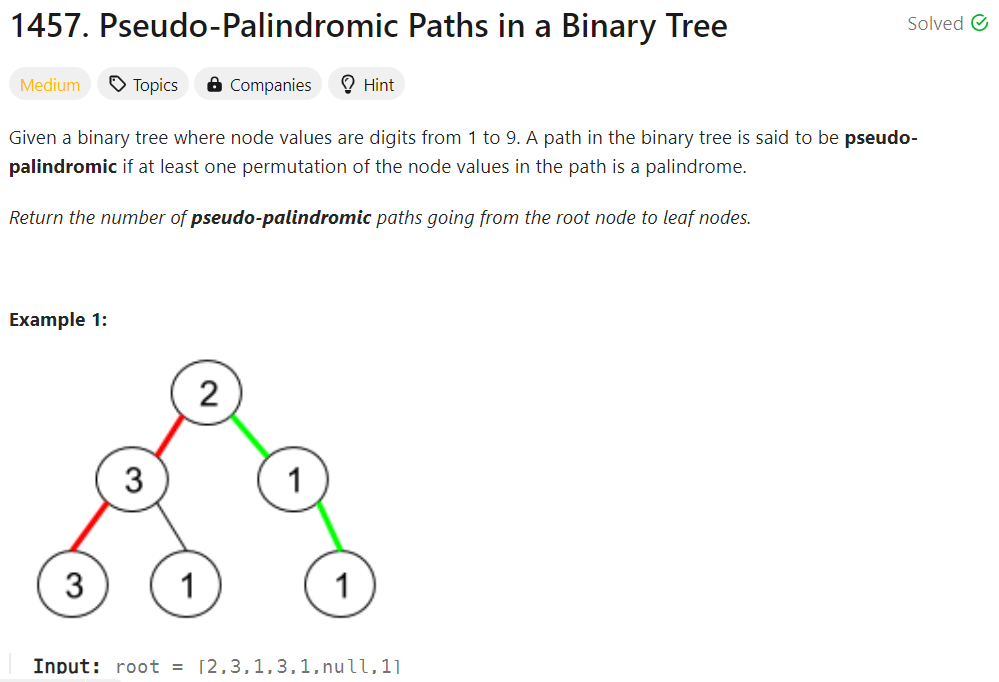

# Probelm



# Approach
- traverse the binary tree using depth-first search (DFS), to keep track of the number of occurences of each node value we use an Array of digits (where `1 <= Node.val <= 9`), if a leaf is reached check whether the path is pseudo-palindromic in condition of one digit should have an odd frequency.

# Complexity
- Time complexity: $O(n)$, where $N$ is a number of nodes.
- Space complexity: $O(n)$

# Code
```java
/**
 * Definition for a binary tree node.
 * public class TreeNode {
 *     int val;
 *     TreeNode left;
 *     TreeNode right;
 *     TreeNode() {}
 *     TreeNode(int val) { this.val = val; }
 *     TreeNode(int val, TreeNode left, TreeNode right) {
 *         this.val = val;
 *         this.left = left;
 *         this.right = right;
 *     }
 * }
 */
class Solution {
    int[] map = new int[10];
    int count = 0, res = 0;

    public int dfs(TreeNode root) {
        if(root == null) return 0;

        map[root.val]++;

        int odd = (map[root.val] % 2 == 1) ? 1 : -1;
        count += odd;

        if(root.left == null && root.right == null)
            res = (count <= 1) ? 1 : 0;
        else
            res = dfs(root.left) + dfs(root.right);

        // up 1 node
        count -= odd;
        map[root.val]--;

        return res;
    }
    
    public int pseudoPalindromicPaths (TreeNode root) {
        return dfs(root);
    }
}
```
