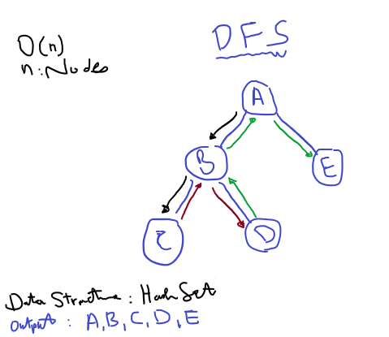
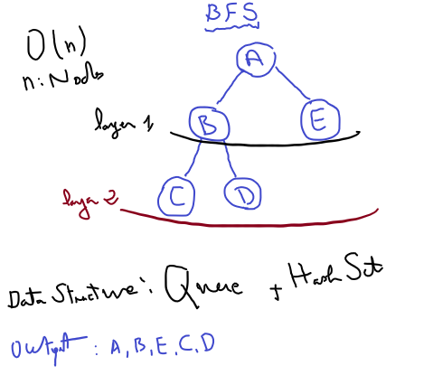

# Common Graph Algorithms

## Depth-First Search (DFS):
- **description:**
  Travel as deep as we can in one direction before backtracking (so we won't stuck in an infinite loop)
- Used for topological sorting, finding connected components, and detecting cycles.
- **Time Complexity:**
  - Linear Time: O(n)
  - n: number of Nodes

## Breadth-First Search (BFS):
- **description:** Traverses a graph layer by layer (start from the closest).
- Useful for finding the shortest path in an unweighted graph.
- **Time Complexity:**
  - Linear Time: O(n)
  - n: number of Nodes

# Refs
- https://cses.fi/problemset/
- https://leetcode.com/problems
<!-- https://www.youtube.com/watch?v=dZ_6MS14Mg4 -->
